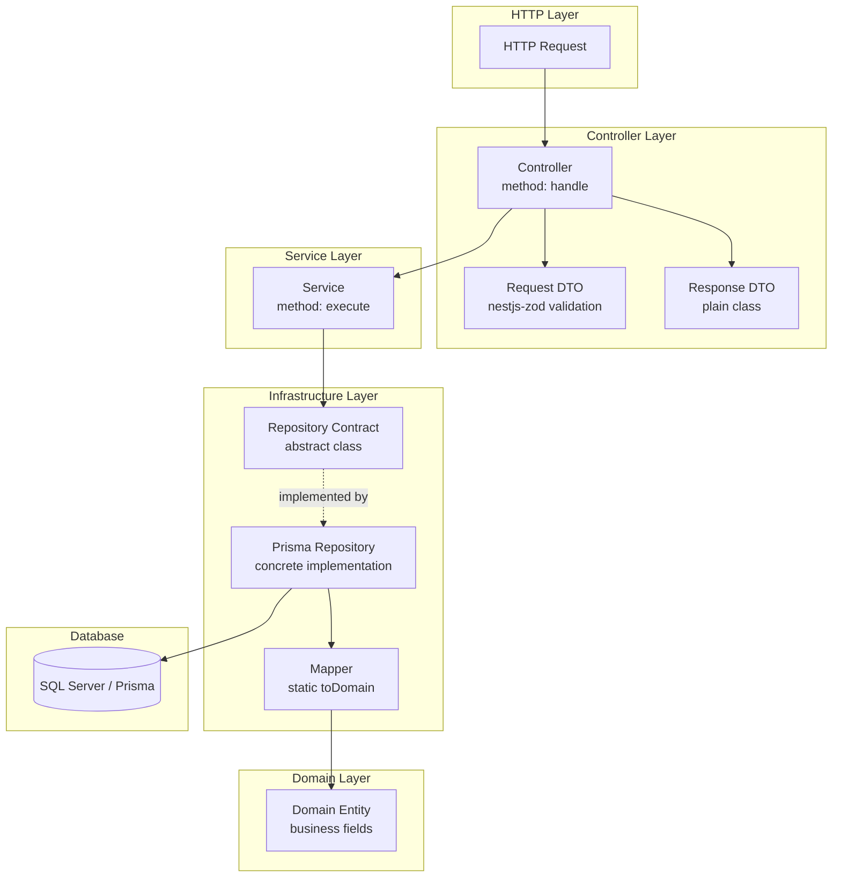
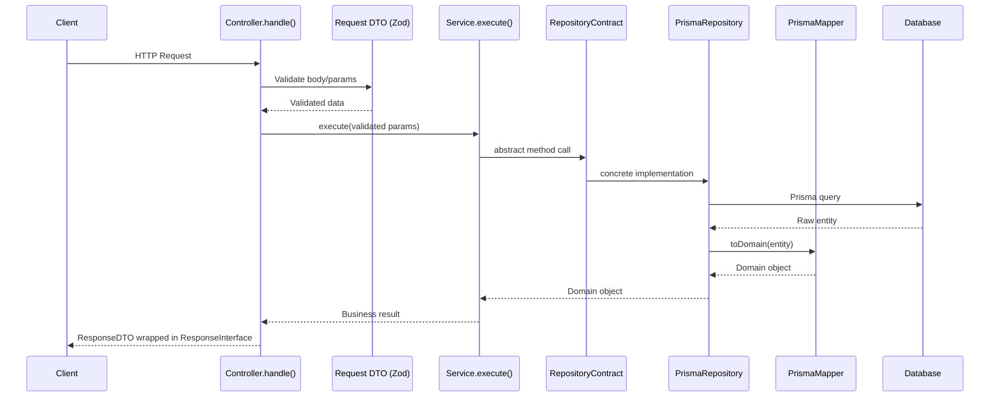
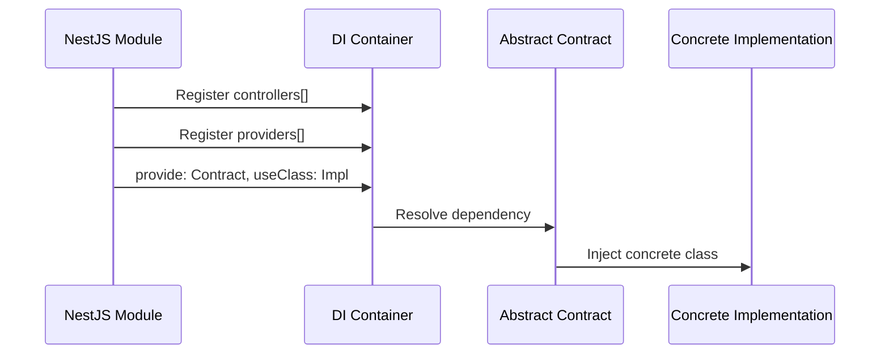

# Design Document: Module Architecture Pipeline

## Overview

Este documento formaliza o pipeline de arquitetura utilizado nos módulos NestJS da aplicação. O padrão define uma estrutura consistente onde cada ação do sistema segue um fluxo unidirecional: Controller → Service → Repository → Domain. Cada camada tem responsabilidades claras, nomenclatura padronizada e contratos bem definidos que garantem desacoplamento, testabilidade e manutenibilidade.

A arquitetura segue princípios de Clean Architecture adaptados ao ecossistema NestJS, utilizando abstract classes como contratos de infraestrutura, DTOs com validação via Zod, e domain objects que representam a lógica de negócio independente do banco de dados.

## Architecture



## Sequence Diagrams

### Request Lifecycle (Ação Simples)



### Module Registration



## Components and Interfaces

### Component 1: Controller

**Purpose**: Ponto de entrada HTTP. Recebe a requisição, delega ao service e formata a resposta.

**Interface**:
```typescript
@Controller()
export class {Action}Controller {
  constructor(private readonly service: {Action}Service) {}

  @{HttpMethod}('{route}')
  async handle(@Body() body: {Action}RequestDto): Promise<ResponseInterface<{Response}Dto>> {
    const result = await this.service.execute(/* params */);
    const response = new {Response}Dto(/* map result */);
    return { response };
  }
}
```

**Responsibilities**:
- Receber e validar input HTTP (body, params, query)
- Delegar lógica de negócio ao Service
- Mapear resultado do Service para Response DTO
- Retornar resposta padronizada via `ResponseInterface<T>`

**Constraints**:
- Um controller por ação (Single Responsibility)
- Método sempre chamado `handle`
- Não contém lógica de negócio
- Arquivo: `controllers/{action}.controller.ts`

---

### Component 2: Service

**Purpose**: Executa a lógica de negócio de uma ação específica.

**Interface**:
```typescript
@Injectable()
export class {Action}Service {
  constructor(
    private readonly repository: {Entity}RepositoryContract,
    // ... other dependencies
  ) {}

  async execute(/* typed params */): Promise<{ResultType}> {
    // business logic
  }
}
```

**Responsibilities**:
- Orquestrar lógica de negócio
- Coordenar chamadas a repositórios e serviços de infraestrutura
- Lançar exceções de domínio quando regras são violadas
- Retornar resultado tipado

**Constraints**:
- Um service por ação (Single Responsibility)
- Método sempre chamado `execute`
- Depende apenas de contratos abstratos (nunca implementações concretas)
- Arquivo: `services/{action}.service.ts`

---

### Component 3: Request DTO

**Purpose**: Define e valida o schema de entrada da requisição usando Zod.

**Interface**:
```typescript
import { createZodDto } from 'nestjs-zod';
import z from 'zod';

export const {Action}RequestSchema = z.object({
  field1: z.string().min(1, { message: 'Mensagem de erro' }),
  field2: z.number().positive(),
  enumField: z.enum(['VALUE_A', 'VALUE_B']).transform(/* map to internal enum */),
});

export class {Action}RequestDto extends createZodDto({Action}RequestSchema) {}
```

**Responsibilities**:
- Definir schema de validação com Zod
- Transformar valores externos em tipos internos (enums, etc.)
- Fornecer mensagens de erro descritivas em português

**Constraints**:
- Usa `createZodDto()` do `nestjs-zod`
- Schema exportado separadamente para reuso em testes
- Arquivo: `controllers/dtos/request/{action}-request.dto.ts`

---

### Component 4: Response DTO

**Purpose**: Define a estrutura de dados retornada ao cliente.

**Interface**:
```typescript
export class {Name}Dto {
  field1: string;
  field2: number;

  constructor(field1: string, field2: number) {
    this.field1 = field1;
    this.field2 = field2;
  }
}
```

**Variações de nomenclatura**:
- `{name}.dto.ts` — DTO padrão
- `{name}-summary.dto.ts` — Resumo com menos campos
- `{name}-details.dto.ts` — Detalhado com mais campos

**Responsibilities**:
- Estruturar dados de saída para o cliente
- Ocultar detalhes internos do domínio

**Constraints**:
- Classe simples com constructor (sem decorators de validação)
- Não contém lógica de negócio
- Arquivo: `controllers/dtos/response/{name}.dto.ts`

---

### Component 5: Repository Contract

**Purpose**: Define o contrato abstrato para acesso a dados, desacoplando o domínio da infraestrutura.

**Interface**:
```typescript
import { DomainEntity } from '../domain/{entity}';

export abstract class {Entity}RepositoryContract {
  abstract buscarPorId(id: number): Promise<DomainEntity | null>;
  abstract buscarPorEmail(email: string): Promise<DomainEntity | null>;
  abstract criar(data: CreateParams): Promise<DomainEntity>;
  abstract atualizar(id: number, data: UpdateParams): Promise<DomainEntity | null>;
}
```

**Responsibilities**:
- Definir interface de acesso a dados
- Tipar retornos como Domain objects (nunca entidades do Prisma)
- Permitir substituição de implementação (testabilidade)

**Constraints**:
- Sempre uma `abstract class` (não interface — necessário para DI do NestJS)
- Métodos retornam Domain objects ou null
- Arquivo: `repositories/{entity}/{entity}-repository.contract.ts`

---

### Component 6: Prisma Repository (Implementação)

**Purpose**: Implementação concreta do contrato usando PrismaService.

**Interface**:
```typescript
@Injectable()
export class Prisma{Entity}Repository extends {Entity}RepositoryContract {
  constructor(private readonly prismaService: PrismaService) {
    super();
  }

  async buscarPorId(id: number): Promise<DomainEntity | null> {
    const entity = await this.prismaService.{model}.findUnique({
      where: { primaryKey: id },
    });
    return Prisma{Entity}Mapper.toDomain(entity);
  }
}
```

**Responsibilities**:
- Executar queries via PrismaService
- Converter resultado do banco para Domain via Mapper
- Encapsular detalhes de infraestrutura (nomes de colunas, relações)

**Constraints**:
- Extends o contrato abstrato correspondente
- Usa `PrismaService` injetado via constructor
- Delega conversão ao Mapper (nunca converte inline)
- Arquivo: `repositories/{entity}/prisma-{entity}.repository.ts`

---

### Component 7: Mapper

**Purpose**: Converte entidades do Prisma (DB schema) para Domain objects (business model).

**Interface**:
```typescript
import { {PrismaModel} } from '@prisma/client';
import { DomainEntity } from '../domain/{entity}';

export class Prisma{Entity}Mapper {
  static toDomain(entity: {PrismaModel}): DomainEntity;
  static toDomain(entity: {PrismaModel} | null): DomainEntity | null;
  static toDomain(entity: {PrismaModel} | null): DomainEntity | null {
    if (entity == null) return null;

    return new DomainEntity(
      entity.fieldA,
      entity.fieldB,
      // ... map fields, convert types (Decimal → number, Date → DateTime)
    );
  }
}
```

**Responsibilities**:
- Converter tipos do Prisma para tipos de domínio (Decimal → number, Date → DateTime via luxon)
- Mapear nomes de colunas do banco para nomes de domínio em português
- Tratar campos opcionais (null → undefined)

**Constraints**:
- Método estático `toDomain` com overloads para null safety
- Não contém lógica de negócio
- Arquivo: `repositories/{entity}/prisma-{entity}.mapper.ts`

---

### Component 8: Domain Entity

**Purpose**: Representa um conceito de negócio com seus campos e comportamentos.

**Interface**:
```typescript
export class {Entity} {
  constructor(
    public readonly campo1: string,
    public readonly campo2: number,
    public readonly dataCriacao: DateTime,
    public readonly id: number,
    public campoOpcional?: string,
  ) {}

  // Métodos de domínio (comportamento)
  estaAtivo(): boolean {
    return this.dataDesativacao == null;
  }
}
```

**Responsibilities**:
- Representar conceito de negócio com campos tipados
- Encapsular regras de negócio simples (validações, cálculos)
- Servir como modelo canônico entre camadas

**Constraints**:
- Classe simples com constructor properties
- Campos em português com tipos de domínio (DateTime do luxon, não Date nativo)
- Não precisa mapear 1:1 com tabela do banco
- Pode ter métodos de domínio para lógica encapsulada
- Arquivo: `domain/{entity}.ts`

---

### Component 9: Module Registration

**Purpose**: Registra todos os componentes no container de DI do NestJS e vincula contratos a implementações.

**Interface**:
```typescript
@Module({
  controllers: [
    {Action1}Controller,
    {Action2}Controller,
  ],
  providers: [
    {Action1}Service,
    {Action2}Service,
    {
      provide: {Entity}RepositoryContract,
      useClass: Prisma{Entity}Repository,
    },
  ],
  imports: [PrismaModule, /* other shared modules */],
  exports: [/* services or contracts for other modules */],
})
export class {ModuleName}Module {}
```

**Responsibilities**:
- Registrar controllers e providers
- Vincular contratos abstratos a implementações concretas
- Importar módulos compartilhados (PrismaModule, AuthModule, etc.)
- Exportar serviços necessários para outros módulos

**Constraints**:
- Um arquivo de módulo por feature module
- Binding via `{ provide: Contract, useClass: Implementation }`
- Arquivo: `{module-name}.module.ts`

---

### Component 10: Exception

**Purpose**: Exceções de domínio que representam erros de regras de negócio.

**Interface**:
```typescript
import { HttpException, HttpStatus } from '@nestjs/common';

export class {Nome}Exception extends HttpException {
  constructor() {
    super('Mensagem de erro descritiva', HttpStatus.{STATUS_CODE});
  }
}
```

**Responsibilities**:
- Representar violações de regras de negócio
- Prover mensagens descritivas em português
- Mapear para HTTP status codes apropriados

**Constraints**:
- Extends `HttpException` do NestJS
- Mensagem hardcoded no constructor (sem parâmetros)
- Arquivo: `exceptions/{nome}.exception.ts`

## Data Models

### File Structure Model

```
{module-name}/
├── controllers/
│   ├── {action}.controller.ts
│   └── dtos/
│       ├── request/
│       │   └── {action}-request.dto.ts
│       └── response/
│           ├── {name}.dto.ts
│           ├── {name}-summary.dto.ts
│           └── {name}-details.dto.ts
├── services/
│   └── {action}.service.ts
├── repositories/
│   └── {entity}/
│       ├── {entity}-repository.contract.ts
│       ├── prisma-{entity}.repository.ts
│       └── prisma-{entity}.mapper.ts
├── domain/
│   └── {entity}.ts
├── enums/
│   └── {name}.enum.ts
├── exceptions/
│   └── {name}.exception.ts
├── templates/
│   └── {name}.template.ts
└── {module-name}.module.ts
```

### Naming Conventions

| Component | File Pattern | Class Pattern |
|-----------|-------------|---------------|
| Controller | `{action}.controller.ts` | `{Action}Controller` |
| Service | `{action}.service.ts` | `{Action}Service` |
| Request DTO | `{action}-request.dto.ts` | `{Action}RequestDto` |
| Response DTO | `{name}.dto.ts` | `{Name}Dto` |
| Contract | `{entity}-repository.contract.ts` | `{Entity}RepositoryContract` |
| Implementation | `prisma-{entity}.repository.ts` | `Prisma{Entity}Repository` |
| Mapper | `prisma-{entity}.mapper.ts` | `Prisma{Entity}Mapper` |
| Domain | `{entity}.ts` | `{Entity}` |
| Exception | `{name}.exception.ts` | `{Name}Exception` |
| Enum | `{name}.enum.ts` | `{Name}` (TypeScript enum) |
| Module | `{module-name}.module.ts` | `{ModuleName}Module` |

### Path Aliases

| Alias | Path | Usage |
|-------|------|-------|
| `@module/` | `src/modules/` | Cross-module imports |
| `@core/` | `src/core/` | Shared infrastructure (auth, prisma, etc.) |
| `@common/` | `src/common/` | Shared utilities (enums, interfaces, helpers) |

## Algorithmic Pseudocode

### Algorithm: Request Processing Pipeline

```typescript
// ALGORITHM: processRequest
// INPUT: httpRequest (raw HTTP request with body/params)
// OUTPUT: ResponseInterface<T> (standardized response envelope)

// STEP 1: Validation (automatic via nestjs-zod pipe)
// Precondition: Request body matches Zod schema
// Postcondition: All fields are typed and transformed
const validatedDto = zodValidationPipe.transform(httpRequest.body);

// STEP 2: Controller delegates to Service
// Precondition: DTO is fully validated
// Postcondition: Service receives only typed, validated params
const businessResult = await service.execute(
  validatedDto.field1,
  validatedDto.field2,
);

// STEP 3: Map to Response DTO
// Precondition: businessResult is a valid domain object or primitive
// Postcondition: ResponseDTO contains only client-safe fields
const responseDto = new ResponseDto(businessResult.field1, businessResult.field2);

// STEP 4: Wrap in standard envelope
// Postcondition: Client receives { response: T }
return { response: responseDto };
```

### Algorithm: Repository Data Flow

```typescript
// ALGORITHM: repositoryQuery
// INPUT: queryParams (typed search criteria)
// OUTPUT: DomainEntity | null

// STEP 1: Execute Prisma query
// Precondition: PrismaService is connected to database
// Postcondition: Returns raw Prisma entity or null
const prismaEntity = await this.prismaService.{model}.findUnique({
  where: { /* mapped query params */ },
});

// STEP 2: Map to Domain
// Precondition: prismaEntity may be null
// Postcondition: Returns DomainEntity with business types or null
// Invariant: Mapper handles null input → null output
return PrismaMapper.toDomain(prismaEntity);
```

### Algorithm: Module Dependency Resolution

```typescript
// ALGORITHM: resolveDependencies
// INPUT: Module metadata (controllers, providers, imports)
// OUTPUT: Fully resolved DI container

// STEP 1: Register imports (shared modules)
// Postcondition: All exported providers from imports are available
imports.forEach(module => container.import(module));

// STEP 2: Register simple providers (services)
// Postcondition: Services registered with their class token
providers.filter(isClass).forEach(provider => container.register(provider));

// STEP 3: Bind abstract contracts to concrete implementations
// Postcondition: Injecting Contract resolves to Implementation
providers.filter(isBinding).forEach(({ provide, useClass }) => {
  container.bind(provide, useClass);
});

// STEP 4: Register controllers with resolved dependencies
// Postcondition: All controller constructor params are resolvable
controllers.forEach(controller => container.registerController(controller));
```

## Key Functions with Formal Specifications

### Function: Controller.handle()

```typescript
async handle(@Body() body: RequestDto): Promise<ResponseInterface<ResponseDto>>
```

**Preconditions:**
- `body` passed Zod validation (guaranteed by nestjs-zod pipe)
- All required fields are present and correctly typed
- Enum transforms already applied

**Postconditions:**
- Returns `{ response: ResponseDto }` on success
- Throws `HttpException` subclass on business rule violation
- No side effects beyond what `service.execute()` performs

**Loop Invariants:** N/A

---

### Function: Service.execute()

```typescript
async execute(...params: TypedParams): Promise<BusinessResult>
```

**Preconditions:**
- All params are pre-validated (controller ensures this)
- Injected dependencies (repositories, services) are available and connected

**Postconditions:**
- Returns typed business result on success
- Throws domain-specific Exception on rule violation
- Database state is consistent (atomic operations via Prisma transactions when needed)

**Loop Invariants:** N/A

---

### Function: Mapper.toDomain()

```typescript
static toDomain(entity: PrismaModel): DomainEntity;
static toDomain(entity: PrismaModel | null): DomainEntity | null;
static toDomain(entity: PrismaModel | null): DomainEntity | null
```

**Preconditions:**
- `entity` is either a valid Prisma model instance or null
- If not null, all required fields are present (DB constraints guarantee this)

**Postconditions:**
- If `entity` is null → returns null
- If `entity` is not null → returns valid DomainEntity with all fields mapped
- Decimal fields converted to number via `.toNumber()`
- Date fields converted to `DateTime` via `DateTime.fromJSDate()`
- Optional DB fields (null) mapped to optional domain fields (undefined)
- No mutations to input entity

**Loop Invariants:** N/A

---

### Function: RepositoryContract abstract methods

```typescript
abstract buscarPorId(id: number): Promise<DomainEntity | null>;
abstract criar(data: CreateParams): Promise<DomainEntity>;
```

**Preconditions:**
- `id` is a valid positive integer
- `data` contains all required fields for entity creation

**Postconditions:**
- `buscarPor*` returns DomainEntity if found, null otherwise
- `criar` returns newly created DomainEntity (never null)
- `atualizar` returns updated DomainEntity if found, null if not found
- All return values are Domain objects (never raw Prisma entities)

**Loop Invariants:** N/A

## Example Usage

### Example 1: Creating a complete module (e.g., "criar-filial")

```typescript
// 1. Domain Entity — domain/filial.ts
import { DateTime } from 'luxon';

export class Filial {
  constructor(
    public readonly id: number,
    public readonly nome: string,
    public readonly dataAtivacao: DateTime,
    public readonly dataDesativacao?: DateTime,
  ) {}

  estaAtiva(): boolean {
    return this.dataDesativacao == null;
  }
}
```

```typescript
// 2. Repository Contract — repositories/filial/filial-repository.contract.ts
import { Filial } from '../../domain/filial';

export abstract class FilialRepositoryContract {
  abstract buscarPorId(id: number): Promise<Filial | null>;
  abstract criar(nome: string, enderecoId: number): Promise<Filial>;
}
```

```typescript
// 3. Mapper — repositories/filial/prisma-filial.mapper.ts
import { Filial as PrismaFilial } from '@prisma/client';
import { Filial } from '../../domain/filial';
import { DateTime } from 'luxon';

export class PrismaFilialMapper {
  static toDomain(entity: PrismaFilial): Filial;
  static toDomain(entity: PrismaFilial | null): Filial | null;
  static toDomain(entity: PrismaFilial | null): Filial | null {
    if (entity == null) return null;

    return new Filial(
      entity.nCdFilial.toNumber(),
      entity.cNmFilial,
      DateTime.fromJSDate(entity.dAtivacao),
      entity.dDesativacao ? DateTime.fromJSDate(entity.dDesativacao) : undefined,
    );
  }
}
```

```typescript
// 4. Prisma Repository — repositories/filial/prisma-filial.repository.ts
import { Injectable } from '@nestjs/common';
import { FilialRepositoryContract } from './filial-repository.contract';
import { PrismaService } from '@core/prisma/services/prisma.service';
import { Filial } from '../../domain/filial';
import { PrismaFilialMapper } from './prisma-filial.mapper';

@Injectable()
export class PrismaFilialRepository extends FilialRepositoryContract {
  constructor(private readonly prismaService: PrismaService) {
    super();
  }

  async buscarPorId(id: number): Promise<Filial | null> {
    const entity = await this.prismaService.filial.findUnique({
      where: { nCdFilial: id },
    });
    return PrismaFilialMapper.toDomain(entity);
  }

  async criar(nome: string, enderecoId: number): Promise<Filial> {
    const entity = await this.prismaService.filial.create({
      data: { cNmFilial: nome, nCdEndereco: enderecoId },
    });
    return PrismaFilialMapper.toDomain(entity);
  }
}
```

```typescript
// 5. Request DTO — controllers/dtos/request/criar-filial-request.dto.ts
import { createZodDto } from 'nestjs-zod';
import z from 'zod';

export const CriarFilialRequestSchema = z.object({
  nome: z.string().min(1, { message: 'Informe o nome da filial' }),
  enderecoId: z.number().positive({ message: 'Informe um endereço válido' }),
});

export class CriarFilialRequestDto extends createZodDto(CriarFilialRequestSchema) {}
```

```typescript
// 6. Response DTO — controllers/dtos/response/filial.dto.ts
import { DateTime } from 'luxon';

export class FilialDto {
  id: number;
  nome: string;
  dataAtivacao: DateTime;

  constructor(id: number, nome: string, dataAtivacao: DateTime) {
    this.id = id;
    this.nome = nome;
    this.dataAtivacao = dataAtivacao;
  }
}
```

```typescript
// 7. Service — services/criar-filial.service.ts
import { Injectable } from '@nestjs/common';
import { FilialRepositoryContract } from '../repositories/filial/filial-repository.contract';
import { Filial } from '../domain/filial';

@Injectable()
export class CriarFilialService {
  constructor(private readonly filialRepository: FilialRepositoryContract) {}

  async execute(nome: string, enderecoId: number): Promise<Filial> {
    return this.filialRepository.criar(nome, enderecoId);
  }
}
```

```typescript
// 8. Controller — controllers/criar-filial.controller.ts
import { Body, Controller, Post } from '@nestjs/common';
import { ResponseInterface } from '@common/interfaces/response-interface';
import { CriarFilialRequestDto } from './dtos/request/criar-filial-request.dto';
import { FilialDto } from './dtos/response/filial.dto';
import { CriarFilialService } from '../services/criar-filial.service';

@Controller()
export class CriarFilialController {
  constructor(private readonly criarFilialService: CriarFilialService) {}

  @Post('filiais')
  async handle(
    @Body() body: CriarFilialRequestDto,
  ): Promise<ResponseInterface<FilialDto>> {
    const result = await this.criarFilialService.execute(body.nome, body.enderecoId);
    const response = new FilialDto(result.id, result.nome, result.dataAtivacao);
    return { response };
  }
}
```

```typescript
// 9. Module — filial.module.ts
import { Module } from '@nestjs/common';
import { CriarFilialController } from './controllers/criar-filial.controller';
import { CriarFilialService } from './services/criar-filial.service';
import { FilialRepositoryContract } from './repositories/filial/filial-repository.contract';
import { PrismaFilialRepository } from './repositories/filial/prisma-filial.repository';
import { PrismaModule } from '@core/prisma/prisma.module';

@Module({
  controllers: [CriarFilialController],
  providers: [
    CriarFilialService,
    {
      provide: FilialRepositoryContract,
      useClass: PrismaFilialRepository,
    },
  ],
  imports: [PrismaModule],
})
export class FilialModule {}
```

## Correctness Properties

### Property 1: Single Responsibility

```typescript
// ∀ controller ∈ Controllers: controller has exactly ONE public method named "handle"
// ∀ service ∈ Services: service has exactly ONE public method named "execute"
assert(controller.publicMethods.length === 1);
assert(controller.publicMethods[0].name === 'handle');
assert(service.publicMethods.length === 1);
assert(service.publicMethods[0].name === 'execute');
```

### Property 2: Contract-Implementation Binding

```typescript
// ∀ contract ∈ RepositoryContracts:
//   ∃! implementation ∈ PrismaRepositories:
//     implementation extends contract
//     AND module.providers contains { provide: contract, useClass: implementation }
assert(implementation instanceof contract);
assert(module.providers.some(p => p.provide === contract && p.useClass === implementation));
```

### Property 3: Mapper Null Safety

```typescript
// ∀ mapper ∈ Mappers:
//   mapper.toDomain(null) === null
//   mapper.toDomain(validEntity) !== null
//   mapper.toDomain(validEntity) instanceof DomainEntity
assert(PrismaMapper.toDomain(null) === null);
assert(PrismaMapper.toDomain(validEntity) instanceof DomainEntity);
```

### Property 4: DTO Validation Completeness

```typescript
// ∀ requestDto ∈ RequestDTOs:
//   requestDto extends createZodDto(schema)
//   AND schema validates ALL required fields
//   AND invalid input throws ZodValidationException (never reaches service)
const invalidInput = { /* missing required fields */ };
expect(() => schema.parse(invalidInput)).toThrow();
```

### Property 5: Domain Independence from Infrastructure

```typescript
// ∀ domainEntity ∈ DomainEntities:
//   domainEntity imports NOTHING from @prisma/client
//   AND domainEntity imports NOTHING from @nestjs/*
//   AND domainEntity uses DateTime (luxon), not Date
assert(!domainEntity.imports.some(i => i.includes('@prisma')));
assert(!domainEntity.imports.some(i => i.includes('@nestjs')));
```

### Property 6: Unidirectional Dependency Flow

```typescript
// Controller → Service → RepositoryContract → (Domain)
// Controller does NOT import Repository
// Service does NOT import Controller
// Domain does NOT import anything from other layers
assert(!controller.imports.includes('RepositoryContract'));
assert(!service.imports.includes('Controller'));
assert(!domain.imports.includes('Service'));
```

## Error Handling

### Error Scenario 1: Validation Failure (Request DTO)

**Condition**: Request body does not match Zod schema (missing fields, wrong types, constraint violations)
**Response**: nestjs-zod pipe intercepts automatically, returns HTTP 400 with validation errors
**Recovery**: Client corrects input and retries. No server-side recovery needed.

### Error Scenario 2: Business Rule Violation (Service)

**Condition**: Domain rule violated (e.g., credentials invalid, entity not found, duplicate entry)
**Response**: Service throws a custom Exception extending HttpException (e.g., `CredenciaisInvalidasException`)
**Recovery**: NestJS exception filter catches and returns appropriate HTTP status (401, 404, 409). Client handles based on status code.

### Error Scenario 3: Database Error (Repository)

**Condition**: Prisma query fails (connection error, constraint violation, timeout)
**Response**: Prisma throws `PrismaClientKnownRequestError` or `PrismaClientUnknownRequestError`
**Recovery**: Global exception filter catches unhandled errors and returns HTTP 500. Logged for investigation.

### Error Scenario 4: Entity Not Found (Repository → Service)

**Condition**: Repository returns `null` for a query
**Response**: Service checks for null and throws appropriate domain exception
**Recovery**: Client receives HTTP 404 or domain-specific error message.

## Testing Strategy

### Unit Testing Approach

Each layer is tested in isolation:

- **Controllers**: Mock the Service, verify `handle()` calls `execute()` with correct params and maps response
- **Services**: Mock the Repository Contract, verify business logic and exception throwing
- **Mappers**: Pure function tests — provide Prisma entity, assert Domain entity fields
- **Domain**: Test business methods (e.g., `expirado()`, `estaAtivo()`)

**Coverage Goals**: 80%+ line coverage on Services and Domain, 100% on Mappers

### Property-Based Testing Approach

**Property Test Library**: `fast-check` (compatible with Jest)

Key properties to test:
- Mapper roundtrip: Domain → (create in DB) → Mapper.toDomain → equivalent Domain
- Zod schema: random valid inputs always parse successfully
- Zod schema: random invalid inputs always throw
- Service: null repository response always produces domain exception

### Integration Testing Approach

- Test complete pipeline (Controller → Service → Repository → DB) using `@nestjs/testing`
- Use in-memory or test database
- Verify DI bindings resolve correctly
- Test that request validation rejects malformed input before reaching service

## Performance Considerations

- Repository queries use indexed fields (`findUnique` on primary keys or unique constraints)
- Mapper conversions are synchronous and lightweight (no I/O)
- One controller + one service per action avoids god-class performance issues
- PrismaService connection pooling managed at module level

## Security Considerations

- Request DTOs validate ALL input before processing (defense against injection)
- Domain layer never exposes raw database field names to clients
- Password hashes handled exclusively in auth module (never in domain entities)
- Abstract contracts prevent direct database access from services

## Dependencies

| Dependency | Purpose | Version |
|-----------|---------|---------|
| `@nestjs/common` | Core framework decorators and pipes | ^11.0.1 |
| `@nestjs/core` | DI container and module system | ^11.0.1 |
| `@prisma/client` | Database ORM | ^7.8.0 |
| `nestjs-zod` | Zod integration for NestJS DTOs | ^5.4.0 |
| `zod` | Schema validation | ^4.4.3 |
| `luxon` | DateTime handling in domain | ^3.7.2 |
